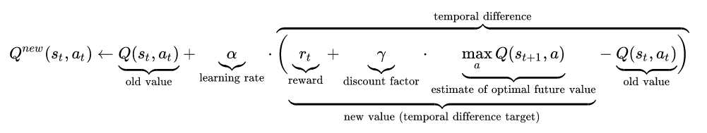
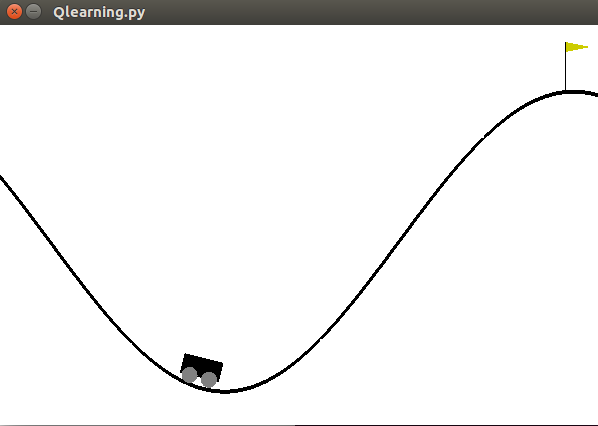
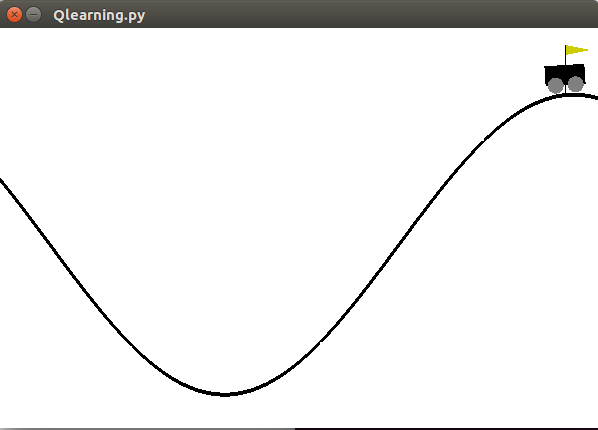

# A simple Q-learning control for MountainCar 

---

## Instructions
To run the code you need only two librairies; [Numpy](https://numpy.org/install/) and [Gym](https://github.com/openai/gym).

If you use pip, you can install NumPy with:

```bash
 pip install numpy
```

and gym with: 
```bash
 pip install gym
```

---

## Algorithm

Q-Learning is a model-free form of machine learning, in the sense that the AI "agent" does not need to know or have a model of the environment that it will be in. For a given environment, everything is broken down into "states" and "actions." The states are observations and samplings that we pull from the environment, and the actions are the choices the agent has made based on the observation. 


The algorithm has a function that calculates the quality of a state–action combination known as Q-table: 


Before learning begins,  is initialized to a random value. Then, at each time  the agent selects an action , 
observes a reward ,
 enters a new state 
 (that may depend on both the previous state 
 and the selected action), and  is updated. The core of the algorithm is a _Bellman equation_ as a simple _value iteration_ update, using the weighted average of the old value and the new information: 

 



_figure credit: https://en.wikipedia.org/wiki/Q-learning_

where 
 is the reward received when moving from the state 
 to the state .

For more details, the reader can see the reference
* Sutton, Richard S., and Andrew G. Barto. Reinforcement learning: An introduction. MIT press, 2018.
---

## Environment

The algorithm is applied to an OpenAI's gym, the "MountainCar-v0" environment. The goal is to learn the car to move from the initial (lower) position to  reach the flag (upper) position, as it is shown in figure below.

  >> into >> 


---
### Copyright

